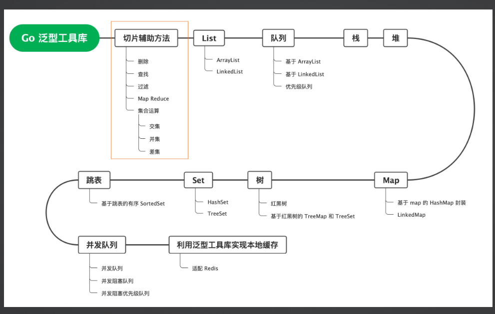

# GO 泛型工具库

在 GO 出来之后，我在公司内部研发了一个 GO 泛型工具库，用于重构在业务代码中的冗余模板代码。该工具库提供了高性能的辅助方法和数据结构，包括:

切片的辅助方法:添加、删除、查找，求并集、交集，map reduce API

map 辅助方法

扩展 map 实现:接受任意类型的 HashMap，TreeMap，LinkedMap

List 实现:LinkedList、ArrayList 和 SkipList

Set:包括HashSet和TreeSet, SortedSet

队列:普通队列、优先级队列

bean 操作辅助类:高性能高扩展的 bean copier 机制

并发扩展工具:包括并发队列、并发阻塞队列、并发阻塞优先级队列

协程池

扩展：
实现redis 的IP 限流

