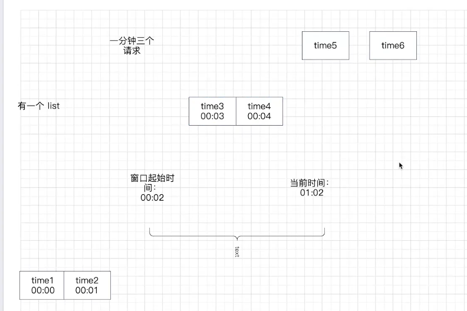
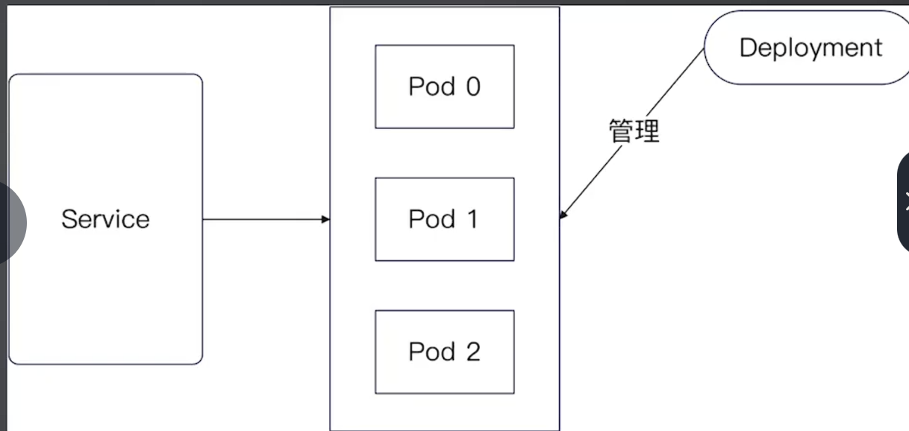
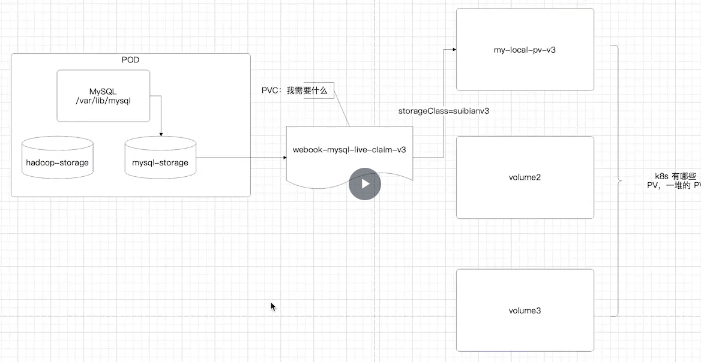

## JWT与 session 混用

流程：JWT 去redis 拿 sessionid，进而保证安全性，提高性能

## 保护系统

wrk：[wg/wrk: Modern HTTP benchmarking tool (github.com)](https://github.com/wg/wrk)

限流算法：限制IP发送，更好是限制 MAC 地址，APP 端考虑使用设备序列号

    限流阈值：根据压力测试极限来设置

    gin 限流插件：小心并发问题

    

因为一分钟可以处理三个请求，此时窗口内处理了 time3，time4。但是！当 time5，time6同时进来时都会被处理，即并发问题。本地锁解决不了，分布式锁解决

解决方案：redis 限流

## webook-record

、

service：逻辑上的业务，xxx 服务的直接映射

pod：实例

Deployment：管理 pod

执行命令kubectl apply -f webook-record-webook-service.yaml ，kubectl get deployments

mysql-depolyment，mysql-service，mysql-pvc（持久化卷)，mysql-pv（卷)

| Name                                                          | Value              | Meaning                           |
| ------------------------------------------------------------- | ------------------ | --------------------------------- |
| apiVersion                                                    | apps/v1            | Kubernetes API 版本               |
| kind                                                          | Deployment         | Kubernetes 资源类型               |
| metadata.name                                                 | webook-mysql       | Deployment 的名称                 |
| metadata.labels.app                                           | webook-mysql       | 用于选择此 Deployment 的标签      |
| spec.replicas                                                 | 1                  | 此 Deployment 应管理的 Pod 副本数 |
| spec.selector.matchLabels.app                                 | webook-mysql       | 用于选择 Pod 的标签               |
| spec.template.metadata.name                                   | webook-mysql       | Pod 的名称                        |
| spec.template.metadata.labels.app                             | webook-mysql       | 用于选择此 Pod 的标签             |
| spec.template.spec.containers[0].name                         | webook-mysql       | 容器的名称                        |
| spec.template.spec.containers[0].image                        | mysql:8.0          | 容器的镜像                        |
| spec.template.spec.containers[0].imagePullPolicy              | IfNotPresent       | 镜像拉取策略                      |
| spec.template.spec.containers[0].volumeMounts[0].mountPath    | /var/lib/mysql     | 挂载点的路径                      |
| spec.template.spec.containers[0].volumeMounts[0].name         | mysql-storage      | 挂载点的名称                      |
| spec.template.spec.containers[0].ports[0].containerPort       | 3306               | 容器的端口号                      |
| spec.template.spec.containers[0].ports[0].protocol            | TCP                | 端口的协议                        |
| spec.template.spec.restartPolicy                              | Always             | Pod 的重启策略                    |
| spec.template.spec.volumes[0].name                            | mysql-storage      | 卷的名称                          |
| spec.template.spec.volumes[0].persistentVolumeClaim.claimName | webook-mysql-claim | 持久卷声明的名称                  |

主要流程：

port：service 本身的

nodePort：k8s 集群外访问的端口

targePort：Pod 上暴露的端口

Ingress 是路由规则说明 配置，Ingress controller 是执行配置

### 压测

-t 线程数量，-d 持续时间，-c 并发数，-s 测试脚本
wrk -t1 -d1s -c2 -s ./script/wrk/signup.lua http://localhost:8080/users/signup

wrk -t1 -d1s -c2 -s ./script/wrk/login.lua http://localhost:8080/users/login

wrk -t1 -d1s -c2 -s ./script/wrk/profile.lua http://localhost:8080/users/profile

### 缓存

面相接口编程+依赖注入：用接口定义成字段，用 new 方法传进来，绝不自己搞

没这数据：去数据库加载，给 redis 兜底，如果崩了保护好数据库，方法：做数据库限流（单机限流)

缓存返回 error 去数据库查，回写忽略错误，不做限流容易把数据库搞崩

Redis 做性能优化：没必要
