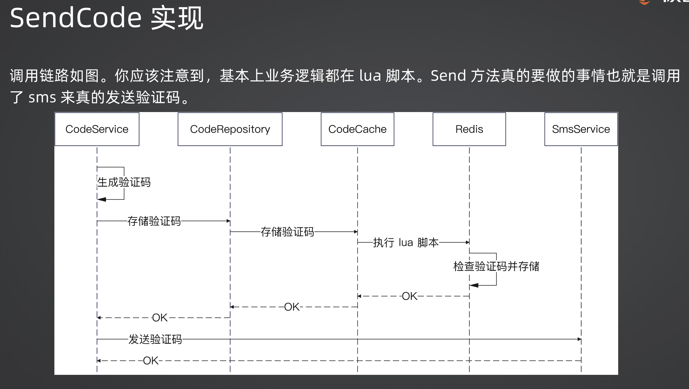
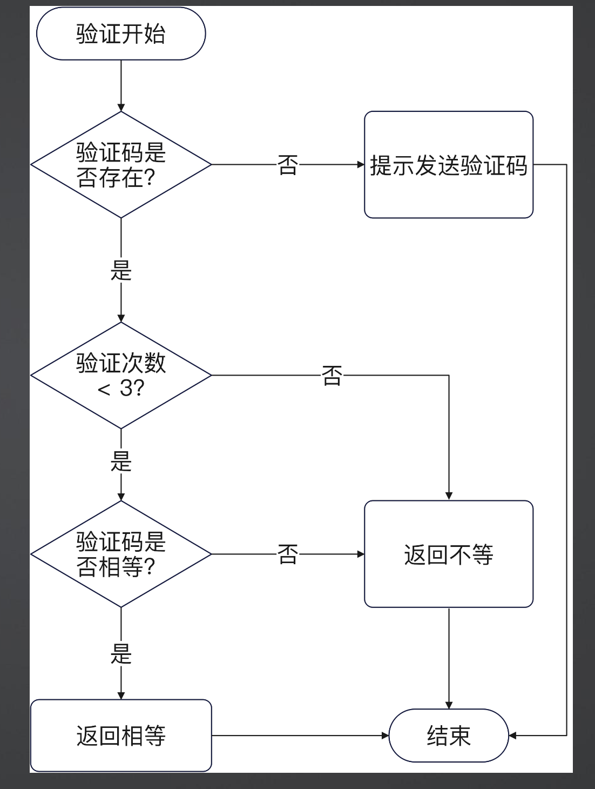
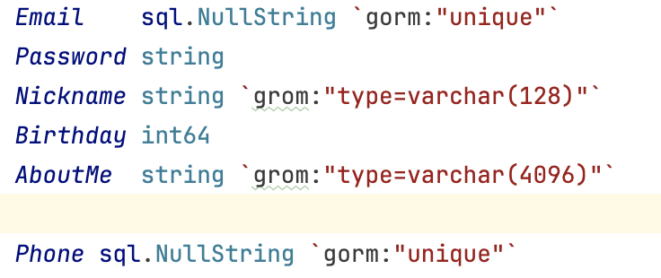
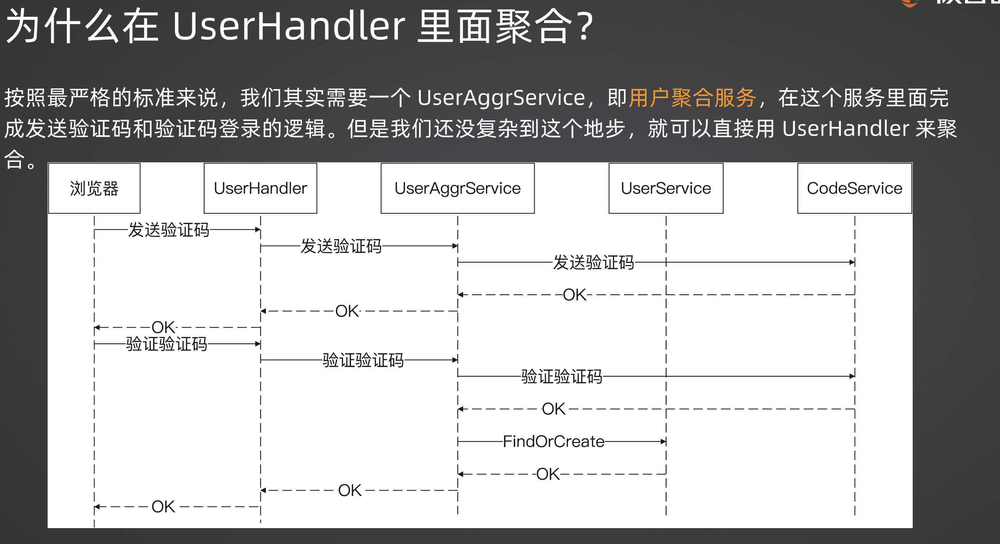
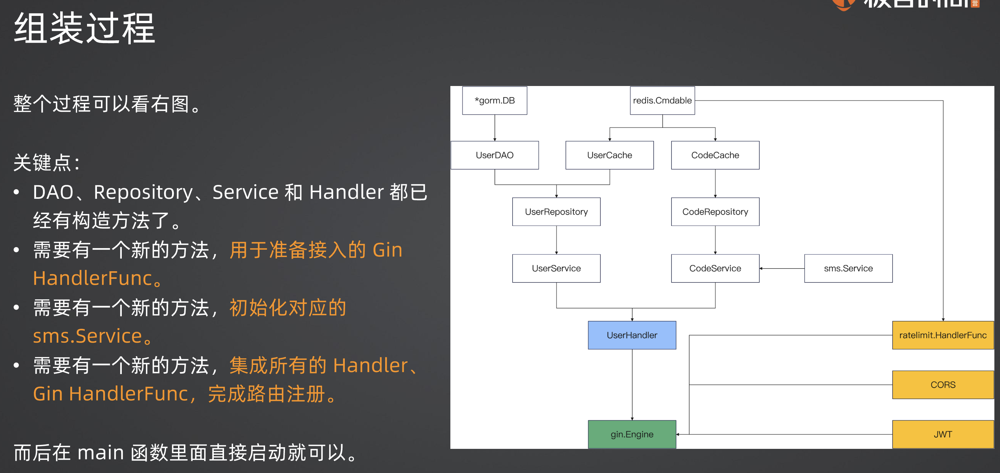
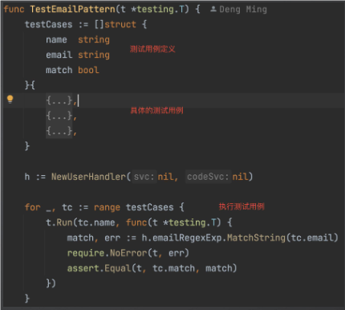

### sms

tencent/ali/local
依赖注入形式

redis 验证码校验

使用 NullString 可以解决邮箱/手机二选一注册的问题

### 用户验证码登录

## 依赖注入

好处是，不需要初始化，深度强耦合依赖初始化过程，无法有效利用公共资源

定义userhandler，提供功能即可，初始化方式（wire，main，ioc，config.yaml)都不管

## 依赖发现

没有像Spring 一样的 Lookenv 实现 Service，只有 cgo可以模拟，但是实现方式很麻烦，所以只能依靠依赖注入

## 组装过程

## 十三章节：单元测试

快速测试，修复，不依赖任何第三方（不能用 mysql，redis)，mock 工具

### Table Driven 模式

