# 微信扫码登录

## 流程

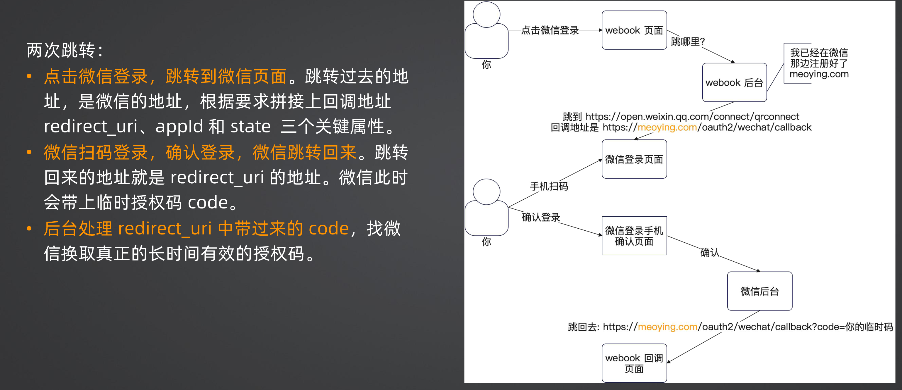

## 设计与实现

## 构造 URL

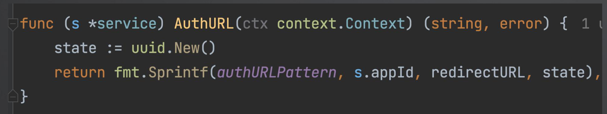

拼接字符串以后等待微信扫码返回一个 code

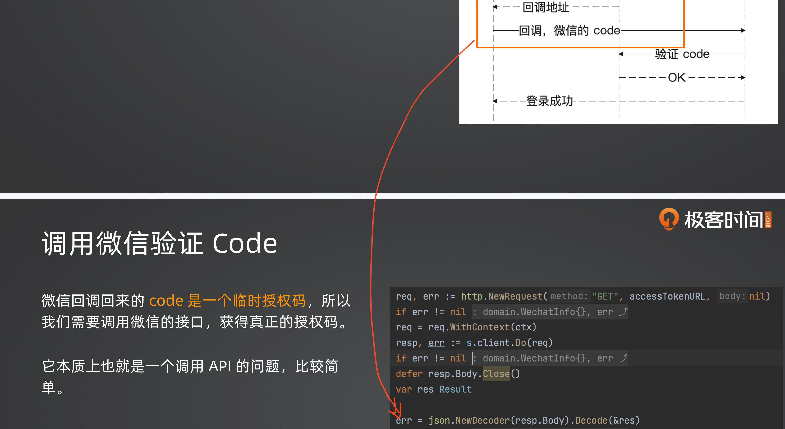

http请求方式: GET
https://api.weixin.qq.com/sns/oauth2/access_token?appid=APPID&secret=SECRET&code=CODE&grant_type=authorization_code

| 参数       | 说明                                                    |
| ---------- | ------------------------------------------------------- |
| appid      | 应用唯一标识，在微信开放平台提交应用审核通过后获得      |
| secret     | 应用密钥AppSecret，在微信开放平台提交应用审核通过后获得 |
| code       | 填写第一步获取的code参数                                |
| grant_type | 填authorization_code                                    |

正确的返回

```text
{
"access_token":"ACCESS_TOKEN",		//接口调用凭证
"expires_in":7200,			//access_token接口调用凭证超时时间，单位（秒）
"refresh_token":"REFRESH_TOKEN",	//用户刷新access_token
"openid":"OPENID",			//授权用户唯一标识
"scope":"SCOPE",			//用户授权的作用域，使用逗号（,）分隔
"unionid": "UNIONID"//用户统一标识。针对一个微信开放平台账号下的应用，同一用户的 unionid 是唯一的
}
```

后面就可以拿着这个access_token去访问微信

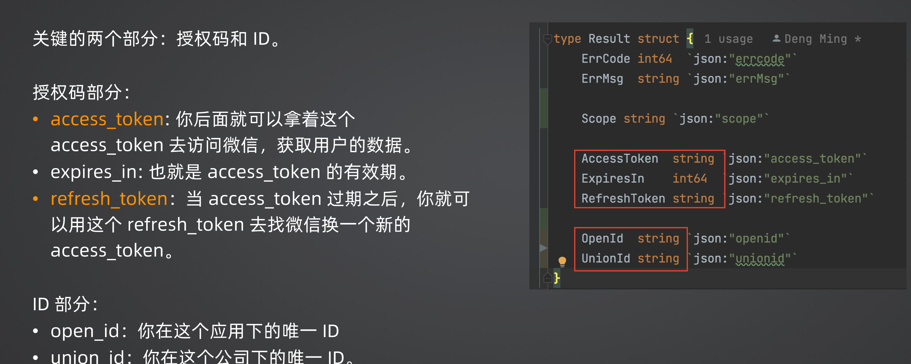

access_token 是短 token，refresh_token 是一个长 token

错误的返回

```{
{
	"errcode":40029,"errmsg":"invalid code"
}
```

### 索引的最左匹配原则

假如索引在 `<A,B,C>建了，A、AB、ABC都可以用，没有 A 就不行`

## state 用法

抓住攻击者让你用他的临时授权码来绑定账号

当我们跳转到微信的时候，生成了state并且传给了微信
当从微信跳回来的时候，微信还是会带回来这个state

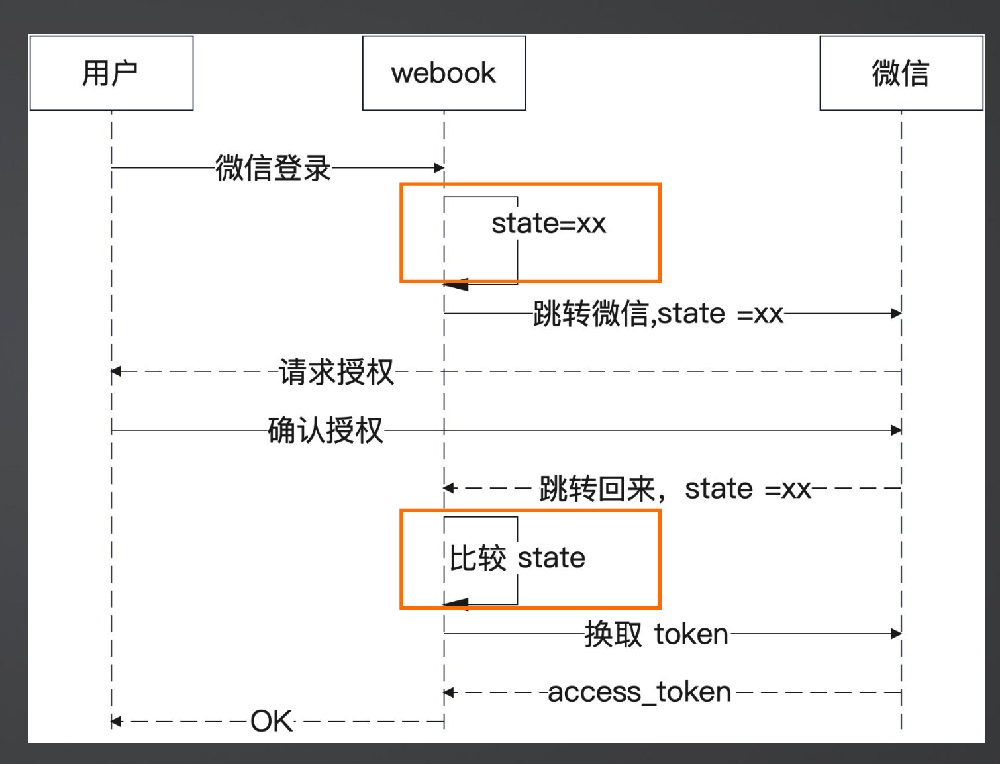

当生成AuthURL时，标识一下这次的会话，将 state 与这一次请求绑定在一起，等到回调时做校验

#### JWT记录 state

直接做对比就可以了，不需要存 Redis 缓存，直接放到 Cookie 里

#### 校验 state

ctx.Quey("state") -> 在校验是否合法jwt.ParseWithClaims -> 是否一致

#### JWT State泄露

CORS 问题肯定存在，Cookie 泄露一般不容易，做好本机安全监控

## 面试

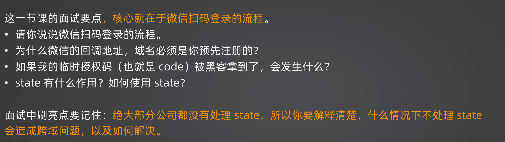

## 长短 token

短 token：access_token，访问资源

长 token：refresh_toklen，短 token 过期后用来生成新的 短token

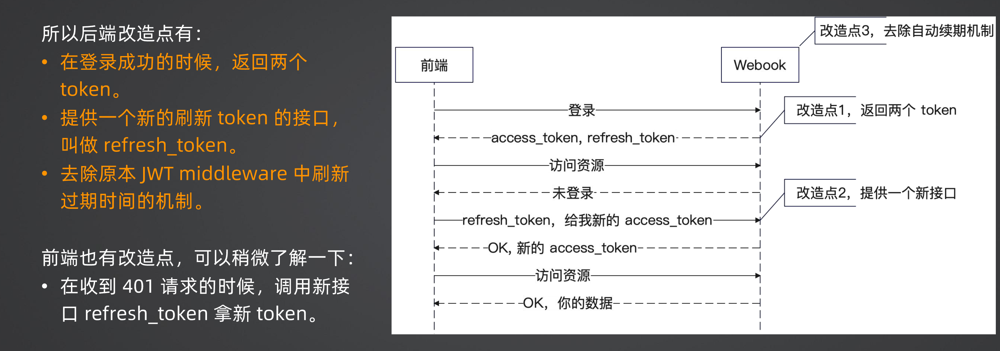

### 改造点 1-返回两个 token

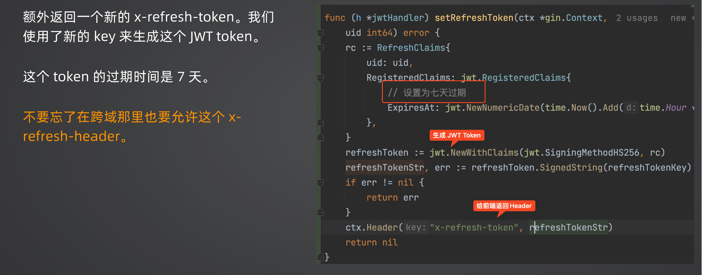

为什么要前端触发：不然就是自动刷新，短 token 频繁使用，长 token 不会频繁使用也并且不容易泄露，自动刷新容易造成泄露

### 改造点2：生成新的短的token

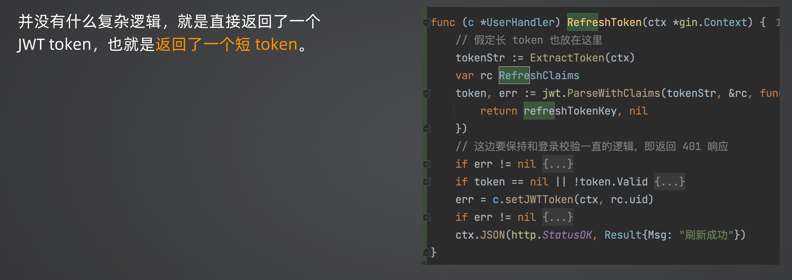

### 改造点 3：去除自动刷新机制

注掉middleware 中的 JWT登录校验中的 if expireTime. Sub (time. NowO))< time. Second*50 这一段

## 退出登录

一般都不做

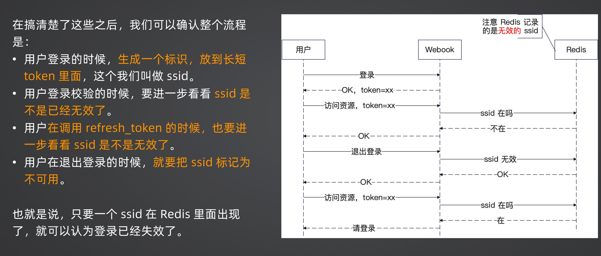

### 改进方案

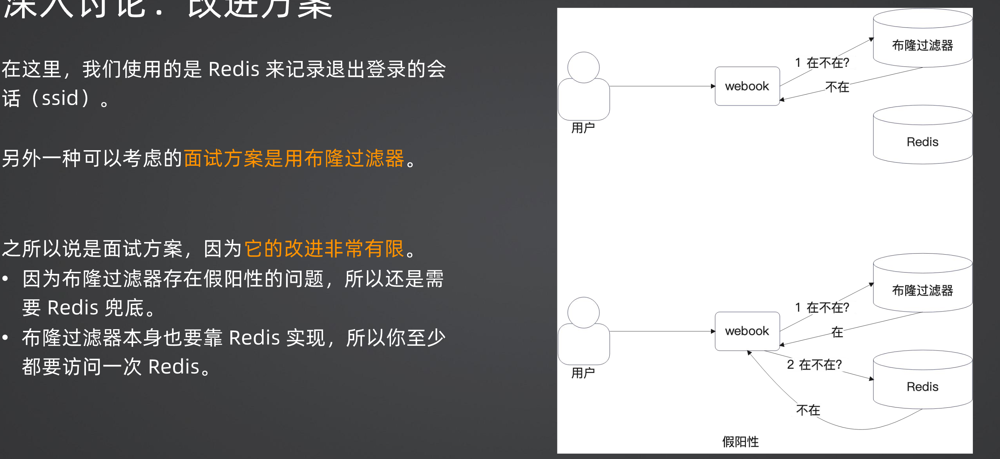

## JWT Handler

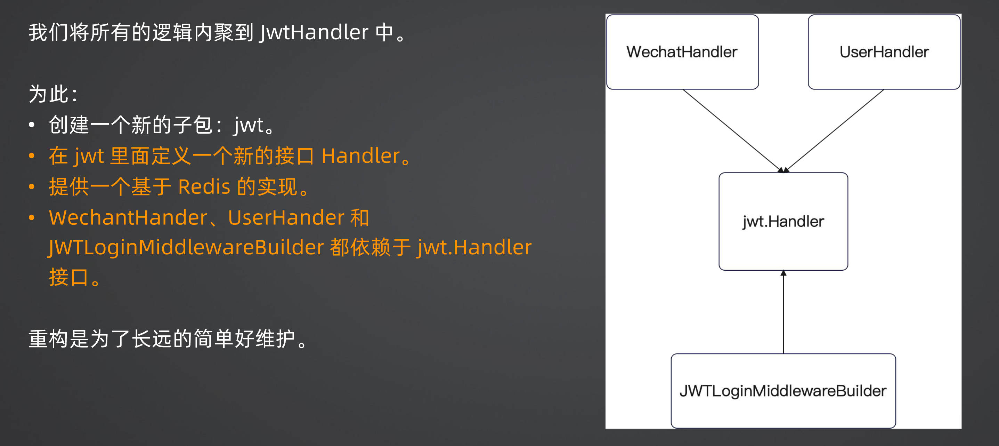

### 1、jwt.Handler

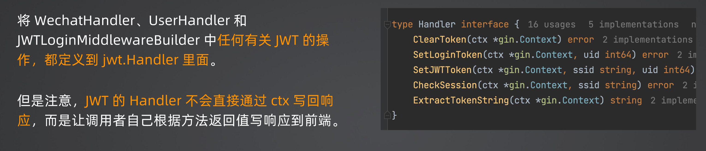

### 2、提供 Redis实现

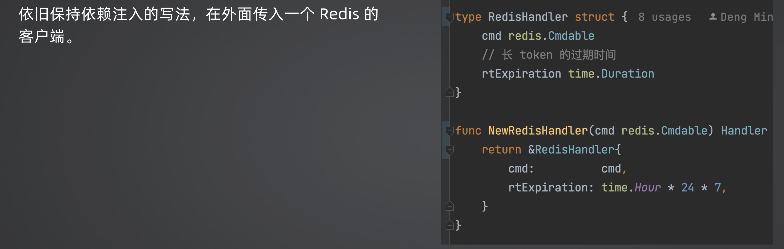

### 3、改造各个Handler

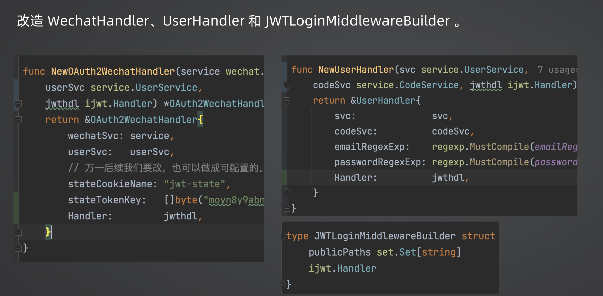

### 4、改造 wire，注入依赖

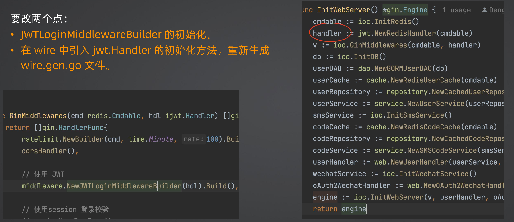

## 面试

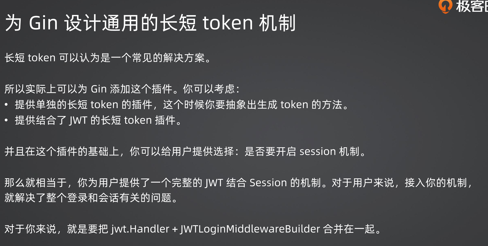

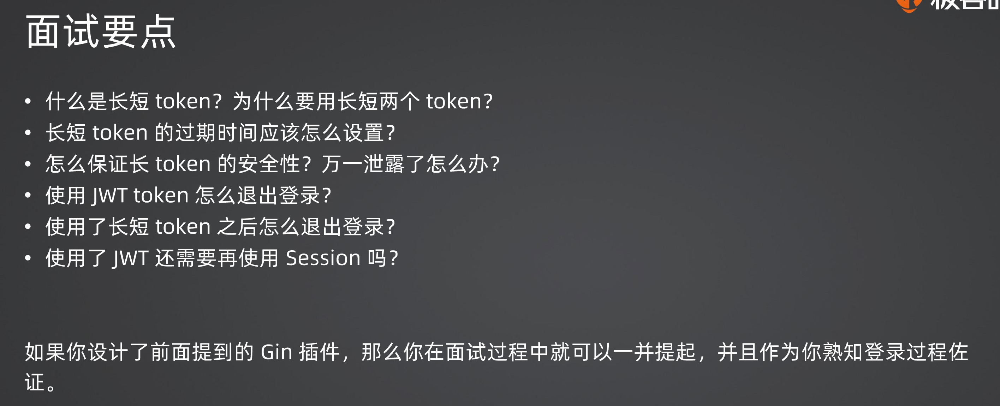

## 接入配置模块 viper

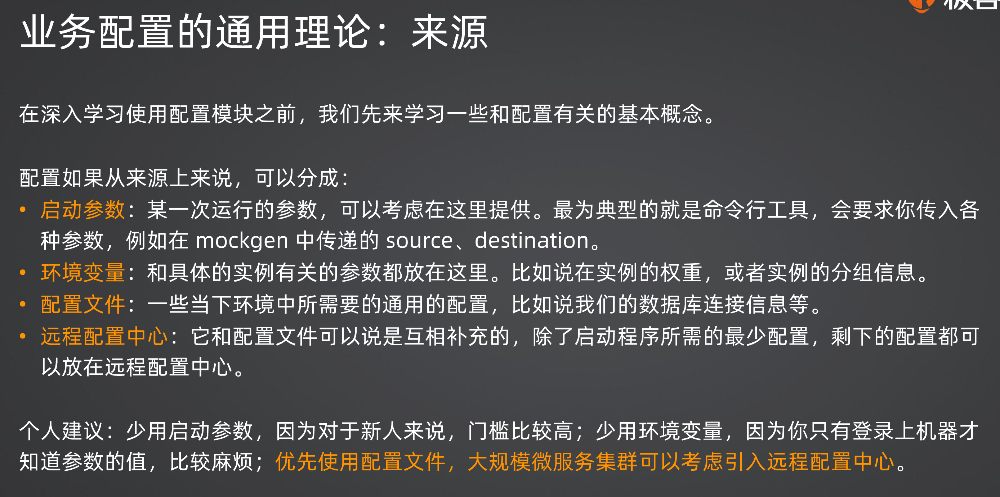

### 远程配置中心 ETCD

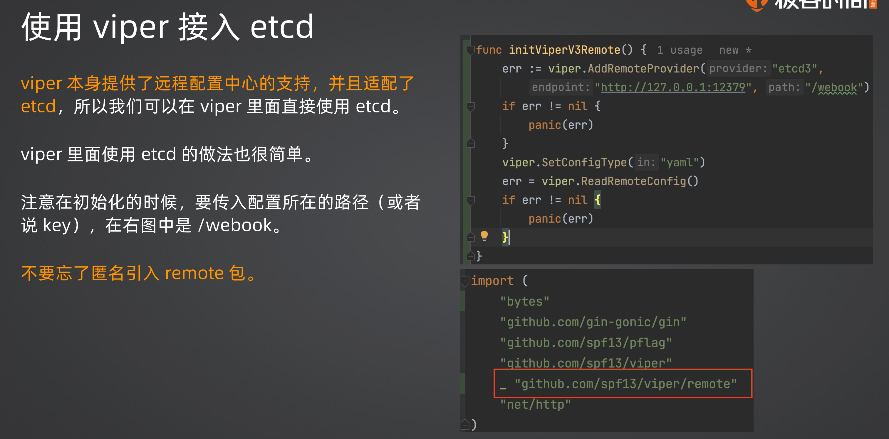

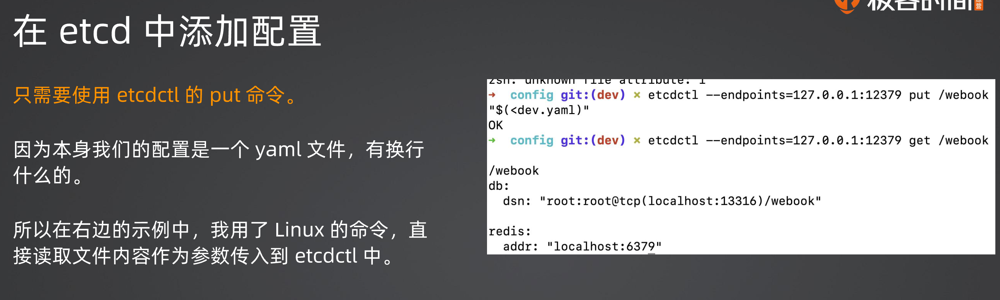
