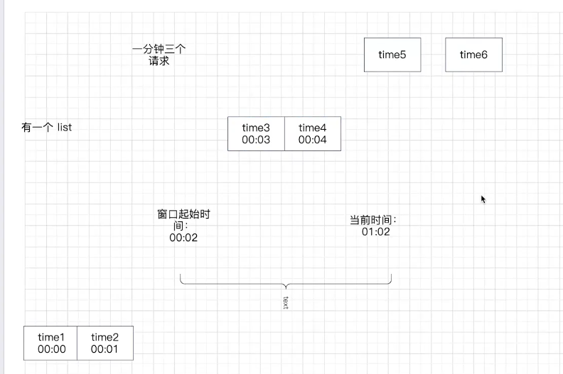

## JWT与 session 混用

流程：JWT 去redis 拿 sessionid，进而保证安全性，提高性能

## 保护系统

wrk：[wg/wrk: Modern HTTP benchmarking tool (github.com)](https://github.com/wg/wrk)

限流算法：限制IP发送，更好是限制 MAC 地址，APP 端考虑使用设备序列号

    限流阈值：根据压力测试极限来设置

    gin 限流插件：小心并发问题

    

因为一分钟可以处理三个请求，此时窗口内处理了 time3，time4。但是！当 time5，time6同时进来时都会被处理，即并发问题。本地锁解决不了，分布式锁解决

解决方案：redis 限流
