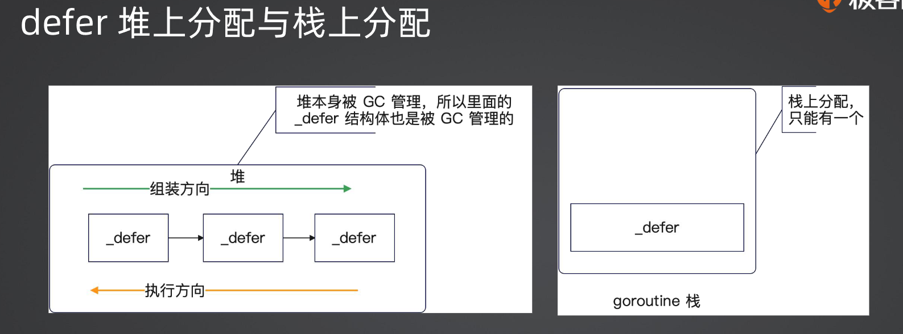

### 闭包

**闭包**是指在函数内部定义的函数，这个内部函数可以访问其外部函数的局部变量和参数，即使外部函数已经执行完毕。这种机制使得这些局部变量的值被"捕获"，并且在闭包函数中被保持和使用。

#### 闭包的缺陷：

1. **内存泄漏**：如果闭包中引用了大量的数据或大型结构，可能导致这些数据无法被垃圾回收，造成内存泄漏。
2. **调试困难**：由于闭包会捕获上下文环境中的变量，调试时可能比较难跟踪变量的状态变化。
3. **性能影响**：闭包需要保存其所在环境的上下文，这会占用额外的内存并可能影响性能。

### 栈溢出

栈溢出（Stack Overflow）是指程序调用栈空间耗尽，通常由以下情况引起：

1. **无限递归**：函数不断调用自身而没有合适的终止条件。
2. **过深的嵌套调用**：函数间相互调用层级过深，超过了栈的最大深度。

### 不定参数

**不定参数**是指函数可以接受不定数量的参数。在 Python 中，不定参数用 `*args` 和 `**kwargs` 来表示：

- `*args`：表示接受任意数量的位置参数，类型为元组。
- `**kwargs`：表示接受任意数量的关键字参数，类型为字典。

**不定参数可以传入 0 个值**。在函数内部使用时，可以像使用普通的元组和字典一样访问它们。

示例：

```python
def example_function(*args, **kwargs):
    for arg in args:
        print(arg)
    for key, value in kwargs.items():
        print(f"{key}: {value}")

example_function(1, 2, 3, a=4, b=5)  # args=(1, 2, 3), kwargs={'a': 4, 'b': 5}
```

### `defer`

在某些编程语言中（例如 Go），`defer` 关键字用于推迟函数或表达式的执行，直到包含它的函数即将返回时才执行。

#### `defer` 实现机制：

在面试问到了defer的时候，你要主动回答这些内容。它能让你拉开和面试者的差距。
defer的内部实现分成三种机制：

* 堆上分配：是指整个defer直接分配到堆上，缺点就是要被GC管理。
* 栈上分配：整个defer分配到了goroutine栈上，不需要被GC管理。比堆上分配性能提升了30%。
* 开放编码（Open Code）：启用内联的优化，你直观理解就是相当于把你的defer内容放到了你的函数最后。启用条件：
  函数的defer数量少于或者等于8个；
  函数的defer关键字不能在循环中执行；
  函数的return语句与defer语句的乘积小于或者等于15个。

  

#### `defer` 的运作机制：

- 当一个函数调用被 `defer` 标记时，它不会立即执行，而是被放入一个栈中。
- 当包含 `defer` 的函数返回时，按照后进先出的顺序依次执行所有被 `defer` 的函数调用。

#### `defer` 内部超过 8 个：

在 Go 语言中，`defer` 语句没有明确的数量限制，因此可以有超过 8 个 `defer`。

#### `defer` 内部修改返回值：

在 Go 中，可以通过命名返回值并在 `defer` 语句中修改它。例如：

```go
func example() (result int) {
    defer func() {
        result++
    }()
    return 0  // 返回值为 1
}
```

### 数组和切片的区别

**数组**：

- 长度固定，定义后不能改变。
- 大小是类型的一部分 `[5]int` 和 `[10]int` 是不同类型。
- 值类型，赋值或传递会复制整个数组。

**切片**：

- 动态大小，可以增长或缩减。
- 底层引用一个数组，可以比数组更灵活使用。
- 引用类型，赋值或传递是引用同一个底层数组。

### 切片扩容

当切片需要扩容时，会按照一定的策略重新分配底层数组，并将原有数据复制到新的数组中。具体步骤：

* 如果切片的容量小于 256（旧版本为256），则新容量一般为旧容量的两倍。
* 如果切片的容量大于等于 256，则新容量会增加 25%。

为什么？减少触发扩容的概率和减少内存浪费之间取得一个权衡

示例（Go 语言）：

```go
slice := make([]int, 0, 2)
slice = append(slice, 1, 2)  // 容量为2
slice = append(slice, 3)     // 容量扩展为4
```

这样，切片可以动态地适应所需的容量，而无需手动调整。
